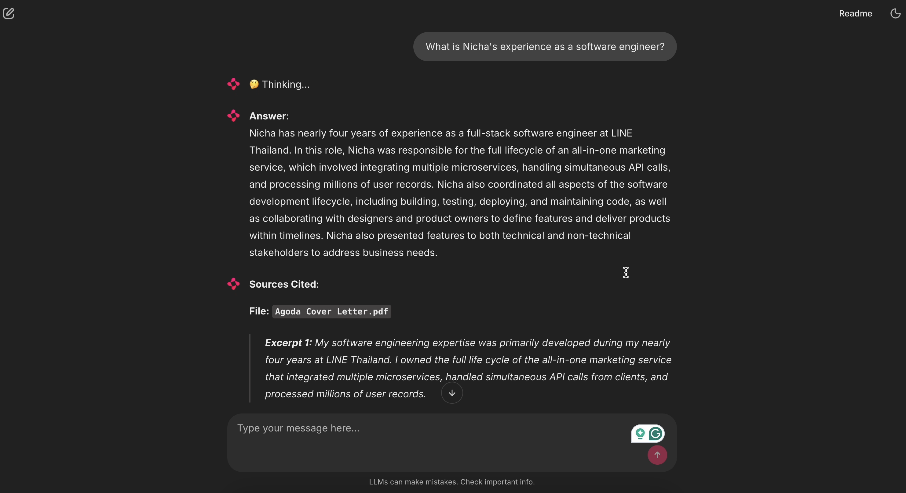

# Chat with your document

## 1. Project Overview

This project is a web application that allows users to upload upto 3 text documents (PDF, word) and ask document-related questions of the system. The system is able to answer user queries and provide an excerpt from the paragraph that contains the answer.

## 2. Demo


For a video demo, please follow this [link](https://drive.google.com/file/d/1Tj_u6Y0d37FF8e-B12GRySaQETG0LI0g/view?usp=sharing)

## 3. How to run the project

### Option 1: Run with Docker

**Prerequisites:**

- Docker and Docker Compose installed

**Steps:**

1. **Create .env file**

   ```bash
   cp .env.example .env
   # Add your GOOGLE_API_KEY to .env
   ```

   Get your free API key from [Google AI Studio](https://aistudio.google.com/api-keys)

2. **Start all services**

   ```bash
   make up
   ```

3. **Access the application**

   - App: http://localhost:8000
   - Milvus UI: http://localhost:9091/webui/

4. **View logs**

   ```bash
   make logs
   ```

5. **Stop services**
   ```bash
   make down
   ```

### Option 2: Run Locally (Development)

**Prerequisites:**

- Python 3.11+
- Docker (for Milvus only)
- uv package manager

**Steps:**

1. **Install dependencies**

   ```bash
   uv sync
   source .venv/bin/activate
   ```

2. **Start Milvus**

   ```bash
   docker compose up -d etcd minio standalone
   ```

3. **Create .env file**

   ```bash
   cp .env.example .env
   # Add your GOOGLE_API_KEY
   ```

4. **Run the app**

   ```bash
   chainlit run app.py --watch
   ```

5. **Access**: http://localhost:8000

## 4. System Architecture

To enable knowledge retrieval from input documents via natural language queries, RAG must be used. RAG is the concept in which the system receives the user's query and retrieves similar documents from a vector database. Then, the top-k most similar documents to the query are passed to the prompt so the LLM can augment the user request with additional context. Finally, the LLM generates the answer and returns the response to the user.

Below is the summary of the process:

```
User uploads → chunk → embed → store → retrieve → LLM → answer
```

The system architecture of this project is divided into two phases: document storage and user retrieval.

### 4.1 Document Storing


In this first stage, the users are asked to input text documents (maximum 3) through the UI to start a conversation with the bot. After that, Docling is used to parse and chunk the input documents, including metadata such as the file name so the user can trace the source later. The resulting chunks are then passed to the embedding model, sentence-transformers/all-MiniLM-L6-v2, which converts them into vectors. The first stage is complete once the vectors, along with their metadata, are successfully stored in Milvus, the vector database.

### 4.2 User Retrieval

After the document content is successfully stored inside the vector database, it is now time for the user to ask questions.

Users can input a query into the system. Then, using the LangChain Retriever, the query is automatically embedded using the same embedding model that was used during the document storage phase. Using the same model ensures that the input query is embedded in a compatible way, which guarantees correct similarity scoring. After that, the top-k retrieved chunks are inserted into the prompt along with the question. The responses are formatted using Pydantic to ensure that the LLM output always includes both the answer to the question and the excerpt the answer is based on, so the user can recheck the source.

## 5. Tech Stack

Below are the tech stacks for this project

**5.1 Chainlit:** The user interface for this application was built on top of Chainlit, an open-source Python framework that allows the building of Conversational AI. Chainlit includes built-in tools for creating a chat interface and uploading documents, making frontend development straightforward.

**5.2 Langchain:** The LLM orchestration framework that connects and coordinates all components in the system, including the LLM, retriever, and external tools.

**5.3 Docling:** The document processing and parsing tools. Docling is good at document understanding, making chunking more intuitive. It also supports hybrid chunking strategies, where the input is chunked in both hierarchical formats to preserve context while maintaining tokenisation-awareness.

**5.4 sentence-transformers/all-MiniLM-L6-v2:** The embedding model that maps paragraphs into a 384-dimensional dense vector space. It has been trained and fine-tuned on a large dataset for clustering and semantic search.

**5.5 Milvus:** The vector database used to store and retrieve embeddings efficiently. It provides high performance for similarity search over large-scale vector data and can be deployed locally via Docker.

**5.6 gemini-2.5-flash-lite:** The LLM to generate the response from the query and retrieval. It was selected for its capabilities and cost efficiency.

## 6. Project Structure

```
agoda-chat-with-doc/
├── app.py                    # Main application entry point with Chainlit UI handlers
├── config.py                 # Configuration settings, environment variables and prompt
├── indexing.py              # Document processing, chunking, and vector store ingestion
├── retrieval.py             # RAG retrieval logic and document formatting
├── schema.py                # Pydantic models for structured LLM responses
├── error_handler.py         # Centralized error handling and logging
│
├── pyproject.toml           # Project dependencies and metadata
├── uv.lock                  # Locked dependency versions
├── pytest.ini               # Pytest configuration
├── makefile                 # Docker and development commands
├── Dockerfile               # Docker image definition
├── docker-compose.yml       # Multi-container Docker setup
├── .env.example             # Environment variables template
│
├── tests/                   # Unit and integration tests
├── images/                  # Architecture diagrams
├── .chainlit/               # Chainlit configuration
└── .files/                  # Temporary uploaded files storage
```

## 7. Limitations and future development

This web application is a proof-of-concept RAG system that accepts text documents and extracts information based on user queries. There are many limitations that can be enhanced, including:

1. **Cannot add more documents on the fly:** currently, the system does not support incremental document ingestion. If this feature is required, users could upload additional files and trigger re-indexing to add new content to the vector database for retrieval.
2. **Limited number of text file input:** currently, the system supports only PDF and Word documents. Although their internal structures differ, both formats are well supported by the document parsing pipeline used in this project. Extending the accepted file types would require additional effort to identify suitable extraction strategies for each format and to validate the correctness of the extracted content.
3. **Streaming capability:** the system uses Pydantic to enforce structured JSON output from the LLM, ensuring that each response includes both the answer and the cited source. As a result, response streaming is not supported.
4. **Context awareness:** the LLM does not maintain conversational state and does not keep track of previous queries and responses. For future development, an additional LLM pipeline could be introduced to summarise queries and responses, cache them to avoid repeated retrieval from the vector database, and provide conversational context by injecting the conversation summary into subsequent prompts.
5. **Metrics and observability:**

- **Add latency logging:** the time spent on indexing, retrieving, and the end-to-end user query and response.
- **Token logging:** log the input and output tokens to track trends in system usage costs.
- **Error notifications:** send the error exception to Sentry.
- **Grafana:** Build a dashboard to visualise the system usage and errors.
- **Feedback loop:** Include a like or dislike button to gather user feedback on the system response. Keep track of the feedback to improve the system.
